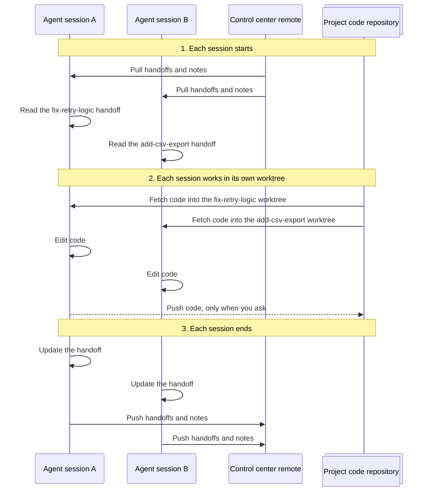

# agent-control-center

A shared workspace for your coding agents. It keeps each project's code,
notes, and task handoffs in one place. Any agent, on any machine, can
continue where the last session stopped.

It works with any agent CLI that reads `AGENTS.md`, such as Claude Code,
opencode, Codex, and Gemini CLI.

## Why use it

| Without a control center | With a control center |
|---|---|
| 🧠 Each session starts from zero. You explain the task again. | Each task has a **handoff** file with its state, decisions, and next steps. The next session reads it first. |
| 💥 Two agents edit the same checkout and break each other's work. | Each task gets its own **Git worktree**. A guard blocks writes to other projects. |
| 💻 Context stays on one laptop or inside one agent CLI. | Handoffs and notes are **Markdown in Git**. They sync to every machine, and every agent CLI can read them. |
| 📜 Each tool has its own rules, and the rules drift apart. | One **`AGENTS.md`** and one set of guidelines apply to every session. |

## When it fits

✅ **Use it** if you run agent sessions across several repositories or
projects, run more than one session at a time, or move between
machines or agent CLIs.

➖ **Skip it** if you work in one repository with one agent at a time.
The agent's own memory and the repository's docs are enough for that.

## How it works

### Two sessions, start to end

Two agents work on the same project at the same time, each on its own
task. They can run on one machine or on different machines. Handoffs
and notes sync through the control center's own Git remote. Code comes
from the project's code repositories, and a project can have many.



**How to read the diagram**

| In the diagram | What it means |
|---|---|
| Column | A participant: an agent session, or a Git remote that stores work. |
| 🗂️ Stacked column | One or more code repositories. A project can span many. |
| ➡️ Solid arrow between columns | Happens without asking you. A hook or a project command runs it. |
| ⇢ Dotted arrow | Happens only when you ask for it. |
| 🔁 Arrow that loops back to its own column | Work inside the session. Nothing leaves the machine. |
| Numbered note | The phase of a session: start, work, end. |

Sessions A and B run at the same time. The diagram lists their steps
one after the other only because a diagram must draw them in some
order. A later session, on any machine, starts at phase 1 with the
latest handoffs. That is how work continues across days and machines.

### What each part holds

| Part | What it holds | When it changes | Synced |
|---|---|---|---|
| **Project manifest** | The project's repositories and status | When a project starts and finishes | ✅ |
| **Handoff** | One task: goal, state, decisions, dead ends, next steps | Before every session ends | ✅ |
| **Notes** | Project knowledge that outlasts one task: designs, plans, system facts | When an agent learns something lasting | ✅ |
| **Global memory** | Preferences and facts for every project | When a lesson applies beyond one project | ✅ |
| **Code** | Clones and task worktrees | While agents work | ❌ Cloned again from the manifest |

### Where agents can write

Each project keeps its code in its own folder. An agent can write only
inside the project where its session runs.

```text
projects/
├── billing-api/                  ← sessions A and B run here
│   ├── PROJECT.md
│   ├── handoffs/
│   ├── notes/
│   └── code/
│       └── api/
│           ├── main/             🔒 read-only reference checkout
│           ├── fix-retry-logic/  ✏️  worktree for session A
│           └── add-csv-export/   ✏️  worktree for session B
└── docs-site/
    └── code/                     🚫 blocked: another project
```

### Trackers (optional)

A project can link to Linear, GitHub Issues, or Jira. Agents offer to
update tickets when work starts and when a session ends. They never
write to a tracker without your approval.

## Daily use

Run these commands in any agent session:

| Command | What it does |
|---|---|
| `/start-project` | Creates a project, clones its repositories, and registers it. |
| `/resume-project` | Pulls the latest documents, checks which branches have merged, and summarizes each active task. |
| `/resume-project <task>` | Does the same, then continues that task from its handoff. |
| `/finish-project` | Checks that no work is unpushed, records the outcome, saves lasting lessons to global memory, and deletes the project's code. |

To start work on a repository, create a worktree for the task:

```sh
bin/wt-new <repo> <task-slug>
```

## Set up

You need `git` and `jq`. The `gh` CLI is optional; with it, branch
checks use pull request state.

**First machine.**

1. Create your own repository from this template ("Use this template"
   on GitHub).
2. Clone it. Any location works.
3. Give the center a name that is unique on this machine:

   ```sh
   ./bin/bootstrap.sh --name <name>
   ```

4. Edit `AGENTS.md` and `guidelines/` to match how you work.

**Each additional machine.**

```sh
git clone <your-control-center-remote> ~/projects/agent-control-center
cd ~/projects/agent-control-center
./bin/bootstrap.sh
```

The name is stored in the repository, so you do not need `--name`
again. You can run `bootstrap.sh` again at any time; it is safe to
repeat.

## Several control centers

You can keep separate centers on one machine, for example `work` and
`personal`. Create each one from this template with its own name. A
session uses the center that it runs inside. Sync and the write guard
cover every center on the machine. Add `--default` to `bootstrap.sh` to
choose the center that sessions outside every center use.

## Rules for agents

`AGENTS.md` holds the rules that every session follows: workspace
limits, commit policy, handoff discipline, and how to share the machine
with other sessions. `guidelines/` holds the writing and coding
guidelines, including adjustments for each model.
